# Attend – System Architecture Diagram

> Extremely detailed system architecture documentation for the AI-powered face recognition attendance system.

---

## 0. Master Architecture Diagram (Complete System)

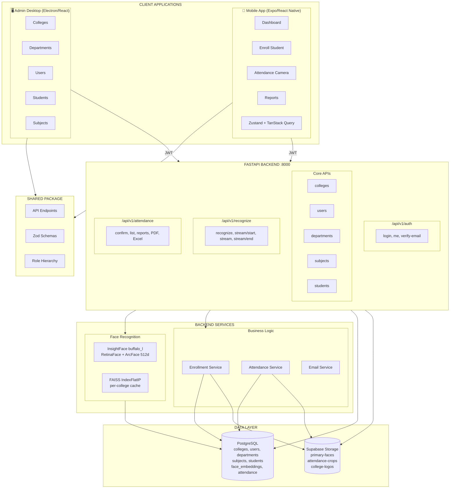

---

## 1. High-Level System Overview

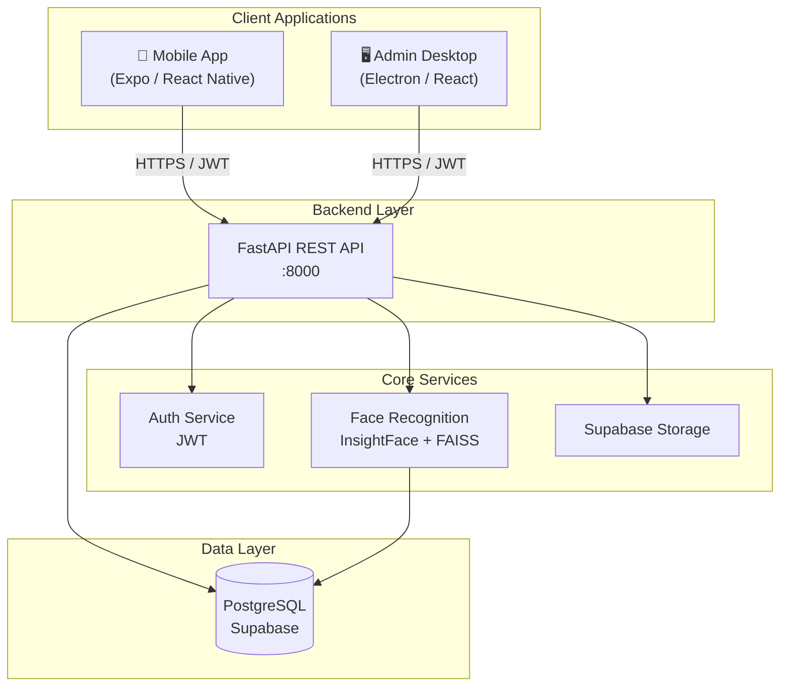

---

## 2. Application Layer Detail

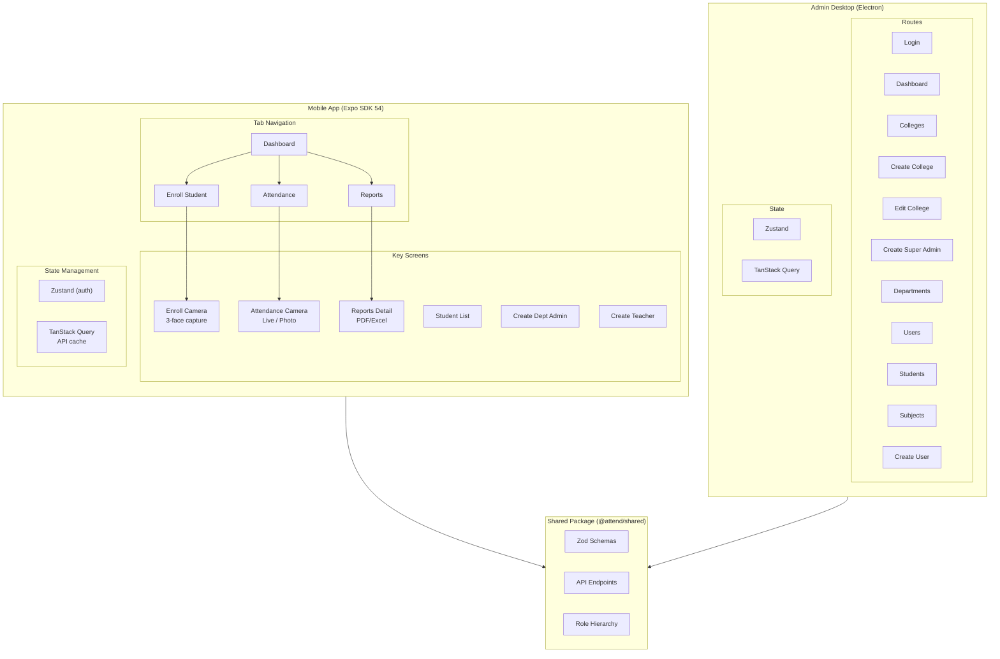

---

## 3. Backend API Architecture

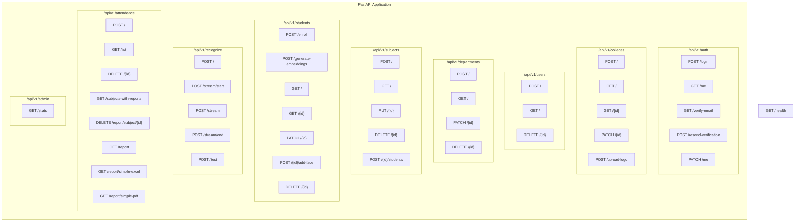

---

## 4. Authentication & Authorization Flow

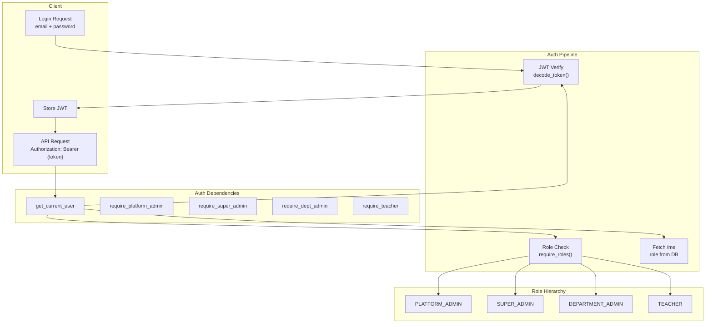

---

## 5. Face Recognition Pipeline

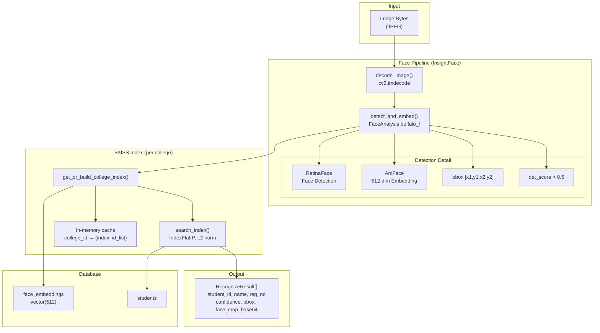

---

## 6. Live Attendance Flow (End-to-End)

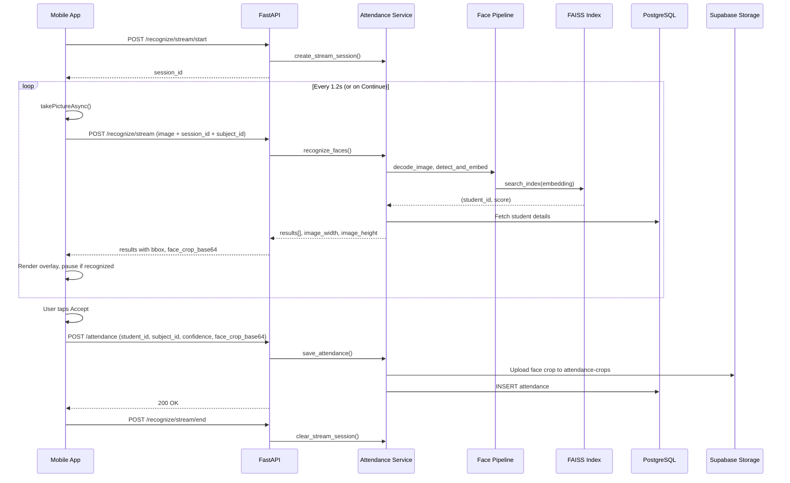

---

## 7. Enrollment Flow

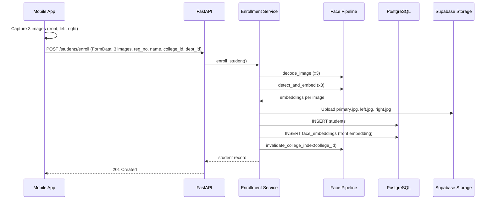

---

## 8. Database Schema (Entity Relationship)

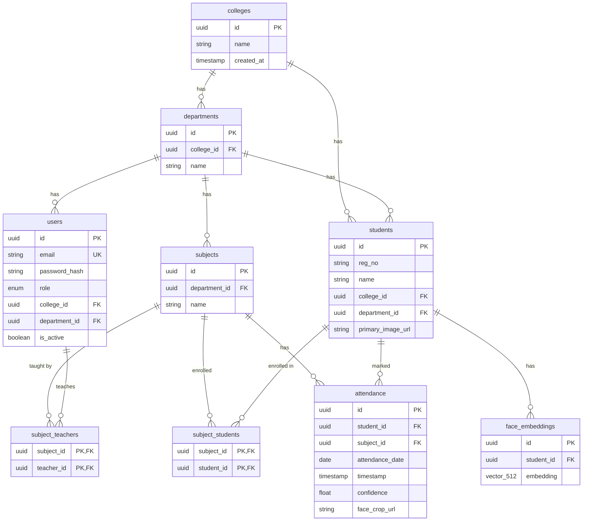

---

## 9. Storage Buckets

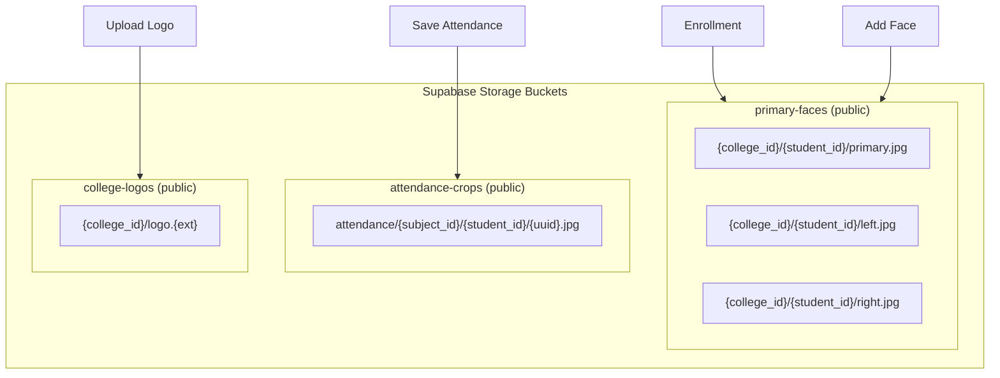

---

## 10. Role-Based Access Control Matrix

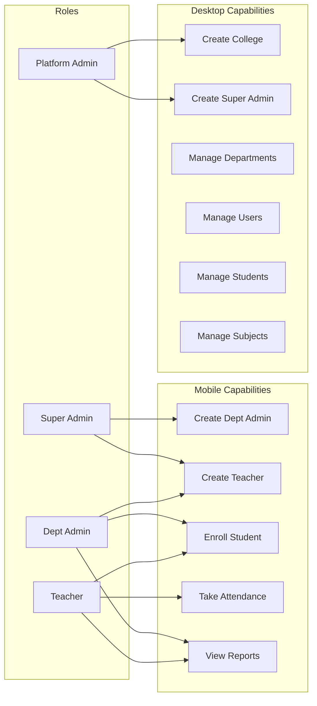

---

## 11. Technology Stack

| Layer | Technology | Purpose |
|-------|------------|---------|
| **Mobile** | React Native 0.81, Expo SDK 54 | Cross-platform iOS/Android |
| **Mobile** | Expo Router 6 | File-based routing |
| **Mobile** | Expo Camera 17 | Face capture |
| **Mobile** | Zustand 4 | Auth state |
| **Mobile** | TanStack Query 5 | API caching |
| **Desktop** | Electron | Desktop shell |
| **Desktop** | React 19, Vite | SPA |
| **Backend** | FastAPI | REST API |
| **Backend** | Uvicorn | ASGI server |
| **Face** | InsightFace (buffalo_l) | RetinaFace + ArcFace |
| **Face** | FAISS | Vector similarity search |
| **Face** | OpenCV (cv2) | Image decode/crop |
| **DB** | PostgreSQL (Supabase) | Primary data store |
| **DB** | pgvector | 512-dim embeddings |
| **Storage** | Supabase Storage | Images |
| **Auth** | JWT (HS256) | Stateless auth |
| **Build** | Turborepo | Monorepo |

---

## 12. Deployment Architecture

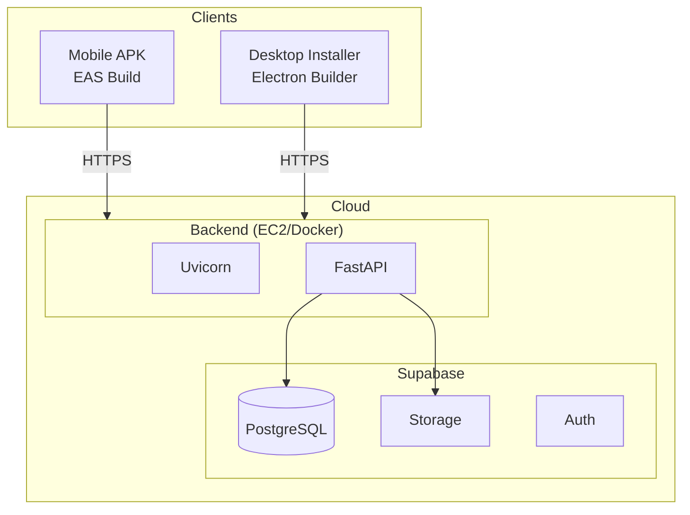

---

## 13. Data Flow Summary

```mermaid
flowchart TB
    subgraph Enrollment["Enrollment Path"]
        E1[3 Face Images] --> E2[InsightFace Detect]
        E2 --> E3[Extract Embeddings]
        E3 --> E4[Store in primary-faces]
        E3 --> E5[Insert face_embeddings]
        E4 --> E6[Invalidate FAISS cache]
    end

    subgraph Recognition["Recognition Path"]
        R1[Single Image] --> R2[Detect + Embed]
        R2 --> R3[FAISS Search]
        R3 --> R4[Match student_id]
        R4 --> R5[Return bbox + crop]
    end

    subgraph Attendance["Attendance Path"]
        A1[Accept Student] --> A2[Upload crop]
        A2 --> A3[Insert attendance]
        A3 --> A4[Invalidate reports cache]
    end
```

---

*Generated from Attend codebase. Last updated: 2025.*
